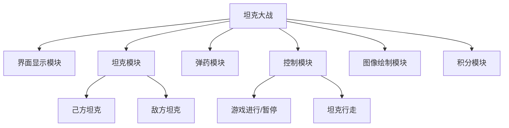

# 坦克大战  - C语言程序设计报告


## 功能需求

#### 显示菜单

- 游戏启动时显示是否开始游戏的选项
- 侧边栏显示操作说明

#### 己方坦克

- 控制行走
- 控制开炮

#### 敌方坦克

- 随机行走
- 自动开炮
- 分类

#### 计分

- 击杀敌方坦克获得分数
- 自己死亡减少分数
- 游戏结束后显示结算页面

#### 多个关卡

- 过关之后显示是否进入下一关的提示
- 通关之后显示相关信息


## 总体设计



## 详细设计与实现


```flow
graph TD

st=>start: 开始
a=>operation: 初始化程序

cond1=>condition: 开始游戏
b=>operation: 移动己方坦克

cond2=>condition: 消灭全部敌人
cond3=>condition: 进入下一关
cond4=>condition: 基地爆炸	

cond5=>condition: 完成全部关卡

c=>operation: 结算界面

ed=>end: 结束

st->a
a->cond1
cond1(yes)->b
cond1(no)->ed

b->cond4
cond2(yes)->cond5
cond2(no)->cond4

cond4(yes)->c
cond4(no)->cond2

cond3(yes)->b
cond3(no)->c

cond5(yes)->c
cond5(no)->cond3

c->ed
```


